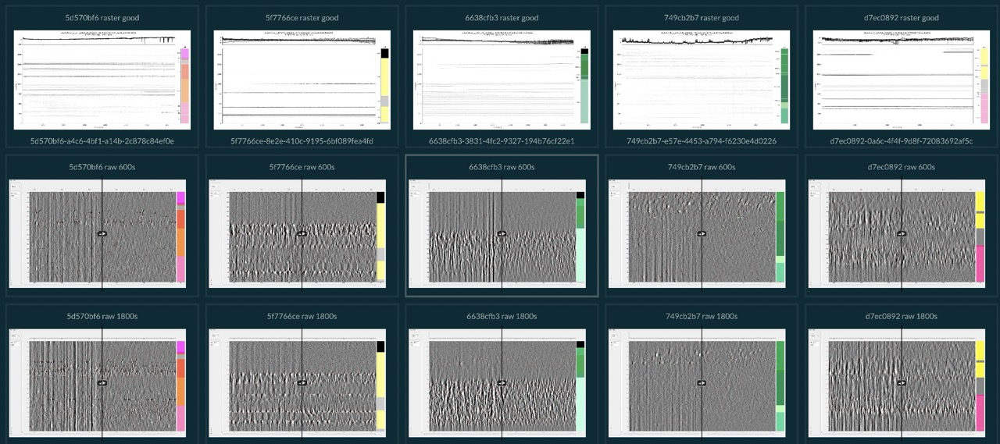

# Reveal presentation builder
Tools to build reveal web-based presentations for scientific visualisations.
Those slide-decks can be navigated as a grid of slides and deployed as static websites.

An example of a such a slide deck can be found here:
[here](http://reveal.internationalbrainlab.org.s3-website-us-east-1.amazonaws.com/benchmarks.html).



# Installation

Install `node.js` and `npm` on your machine.

Clone the `reveal.js` javascript repository:
```
git clone git@github.com:oliche/reveal.js.git -b ibl
cd reveal.js
npm install
```

Clone the `reveal` python repository and install in place:
```
git clone git@github.com:int-brain-lab/reveal.git
pip install -e .
```


# Tutorial

In this tutorial we will create a new presentation from scratch and serve it on a developent server.

In a second time we will deploy the presentation to an S3 bucket and serve it as a static website.

## Create the slide deck

### Create a new project for the slide deck

```shell
PROJECT_NAME=spike_sorting_rerun
git clone https://github.com/oliche/reveal.js.git -b ibl $PROJECT_NAME
cd $PROJECT_NAME
#ln -s ../reveal.js/node_modules node_modules  # optional to avoid duplication of node_modules engine
mkdir img
cp index_template.html index.html
npm install
```

## run a local server
`npm start -- --port=8001`

## update the bucket
aws --profile ibl s3 sync ~/Documents/JS/reveal.js s3://reveal.internationalbrainlab.org --delete --exclude reveal.js/node_modules

## Create a new website

`aws --profile ibl s3 sync ~/Documents/JS/reveal.js s3://reveal.internationalbrainlab.org --exclude reveal.js/node_modules`
http://reveal.internationalbrainlab.org.s3-website-us-east-1.amazonaws.com


```shell
dirname='critical'
bucket=$dirname.internationalbrainlab.org
aws --profile ibl s3api create-bucket --bucket=$bucket --acl=public-read
aws --profile ibl s3 website s3://$bucket/ --index-document index.html

echo '{
    "Version": "2012-10-17",
    "Statement": [
        {
            "Sid": "PublicReadGetObject",
            "Effect": "Allow",
            "Principal": "*",
            "Action": "s3:GetObject",
            "Resource": "arn:aws:s3:::'$bucket'/*"
        }
    ]
}' > /tmp/bucket_policy.json
aws --profile ibl s3api put-bucket-policy --bucket $bucket --policy file:///tmp/bucket_policy.json
aws --profile ibl s3 sync ~/Documents/JS/$dirname s3://$bucket

echo http://$bucket.s3-website-us-east-1.amazonaws.com
```

## Update a website
```shell
bucket=reveal.internationalbrainlab.org
aws --profile ibl s3 sync ~/Documents/JS/reveal s3://reveal.internationalbrainlab.org --delete
echo http://$bucket.s3-website-us-east-1.amazonaws.com --exclude reveal.js/node_modules`
```


